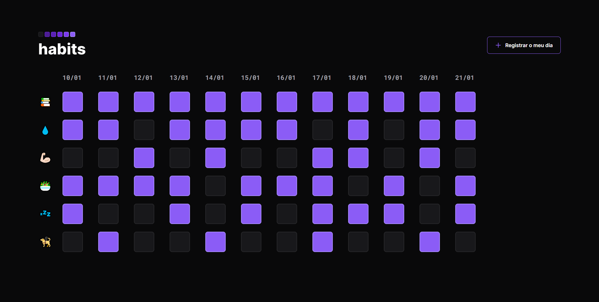

<h1 align="center">Habits</h1>

  [Projeto](#projeto) 
  &nbsp;&nbsp;&nbsp;|&nbsp;&nbsp;&nbsp;
  [Tecnologias](#tecnologias)
  &nbsp;&nbsp;&nbsp;|&nbsp;&nbsp;&nbsp;
  [Layout](#layout)
   &nbsp;&nbsp;&nbsp;|&nbsp;&nbsp;&nbsp;
  [Licença](#license)

  

 

 
 

## 💻 Projeto 

Esse projeto foi feito durante a NLW Setup da Rocketseat na trilha Explorer, em sua 11° edição, onde desenvolvemos um website que faz o controle de hábitos.

 
 

## 🚀 Tecnologias 

- HTML
- CSS
- JavaScript

 
 

## 🔖 Layout 

Você pode visualizar o layout do projeto através [DESSE LINK](https://www.figma.com/file/8zqfmncV3lKe1tV97K7833/Habits-(e)-(Community)?node-id=6%3A344&t=LCwbPlYJK0OEkPFi-1). É necessário ter conta no [Figma](https://figma.com) para acessá-lo.

 
 

##  Licença

Esse projeto está sob a licença MIT.
